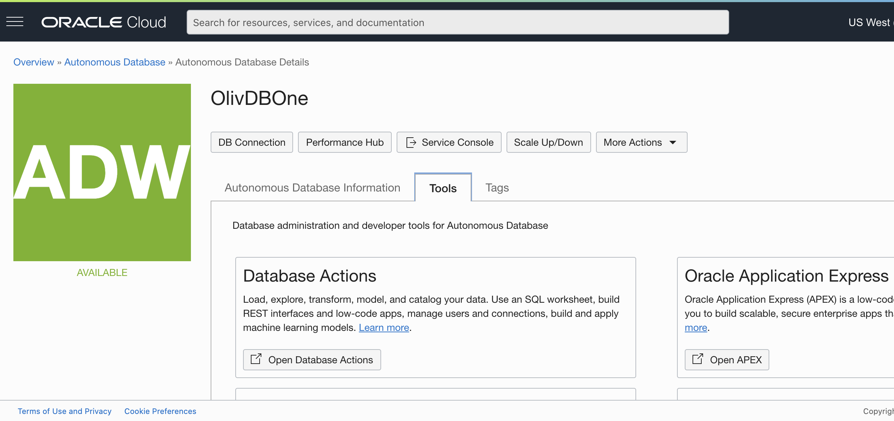

# Oracle DB in the Cloud.
### Oracle Autonomous DataBase, comes for free.

- Get your Oracle Autonomous DataBase in the Cloud for free: <https://oracle.github.io/learning-library/data-management-library/autonomous-database/shared/adb-quickstart-workshop/freetier/>
- JDBC on ATP or ADW: <https://www.oracle.com/database/technologies/java-connectivity-to-atp.html>
- Oracle DB Code samples repo: <https://github.com/oracle/oracle-db-examples>

Log on to your account using <http://cloud.oracle.com>
Then go to your instance, and go to the `Tools` tab.

**Database Actions** will take your where you want to be.

---

